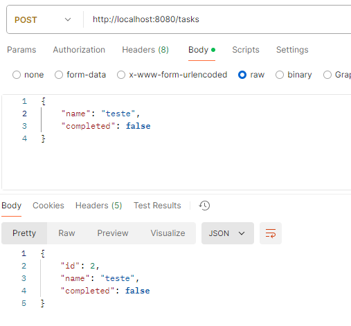
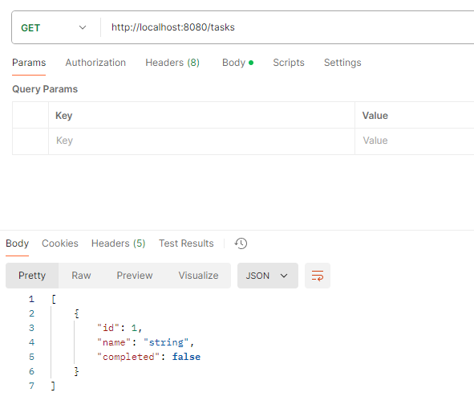
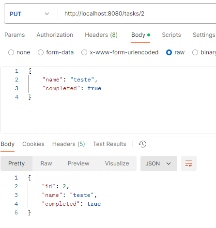
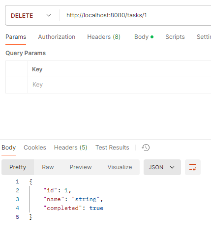

# Backend - To-Do List API

Este arquivo contém informações detalhadas sobre o backend da aplicação To-Do List, que foi implementado utilizando o framework **Spring Boot**. Aqui, você encontrará detalhes sobre cada método da API e como realizar os testes para garantir o correto funcionamento da aplicação.

## Endpoints da API

### 1. **Criar Tarefa (POST /tasks)**

#### Descrição:
Este método cria uma nova tarefa. Ele espera que o usuário envie as informações da tarefa, como o nome e o status (completa ou incompleta). A tarefa será então adicionada à lista interna de tarefas.

---

### 2. **Listar Tarefas (GET /tasks)**

#### Descrição:
Este método retorna todas as tarefas armazenadas na aplicação. Ele permite que o usuário visualize todas as tarefas existentes.

---

### 3. **Alterar Tarefa (PUT /tasks/{id})**

#### Descrição:
Este método permite que o usuário altere o nome ou o status de uma tarefa existente, identificada por seu ID. O usuário deve fornecer os dados atualizados, como o novo nome e o novo status (completa ou incompleta).

---

### 4. **Deletar Tarefa (DELETE /tasks/{id})**

#### Descrição:
Este método remove uma tarefa específica identificada pelo seu ID. Após a exclusão, ele retorna a tarefa deletada.

---