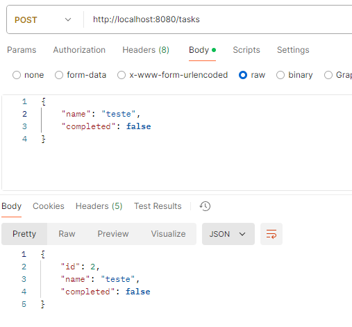
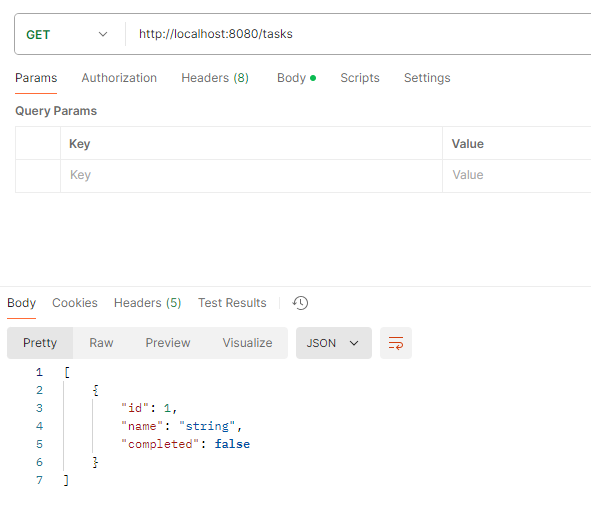
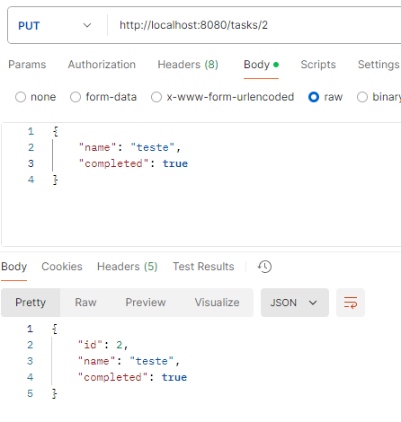
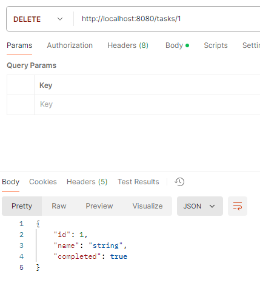

# To-Do List API

Este projeto é uma aplicação simples de gerenciamento de tarefas (To-Do List) construída utilizando o **Spring Boot** no backend e **HTML, CSS, JavaScript** no frontend. O objetivo é fornecer uma API RESTful que permita aos usuários criar, listar, atualizar e deletar tarefas. O projeto foi desenvolvido como parte de um exercício para praticar a criação de uma aplicação web full-stack, integrando frontend e backend.

## Funcionalidades

- **Criar Tarefa:** Permite ao usuário criar uma nova tarefa com nome e status.
- **Listar Tarefas:** Exibe todas as tarefas armazenadas.
- **Atualizar Tarefa:** Permite atualizar o nome ou o status de uma tarefa existente.
- **Deletar Tarefa:** Exclui uma tarefa do banco de dados.

## Tecnologias Usadas

- **Backend:** Spring Boot
    - Java 18
    - Spring Boot 3.x
    - Spring Web
    - Swagger (para documentação da API)

- **Frontend:** HTML, CSS, JavaScript
    - Interação com o backend via chamadas AJAX utilizando o Axios

## Endpoints da API

### 1. **Criar Tarefa (POST /tasks)**

#### Descrição:
Este método cria uma nova tarefa. Ele espera que o usuário envie as informações da tarefa, como o nome e o status (completa ou incompleta). A tarefa será então adicionada à lista interna de tarefas.

---

### 2. **Listar Tarefas (GET /tasks)**

#### Descrição:
Este método retorna todas as tarefas armazenadas na aplicação. Ele permite que o usuário visualize todas as tarefas existentes.

---

### 3. **Alterar Tarefa (PUT /tasks/{id})**

#### Descrição:
Este método permite que o usuário altere o nome ou o status de uma tarefa existente, identificada por seu ID. O usuário deve fornecer os dados atualizados, como o novo nome e o novo status (completa ou incompleta).

---

### 4. **Deletar Tarefa (DELETE /tasks/{id})**

#### Descrição:
Este método remove uma tarefa específica identificada pelo seu ID. Após a exclusão, ele retorna a tarefa deletada.

---
