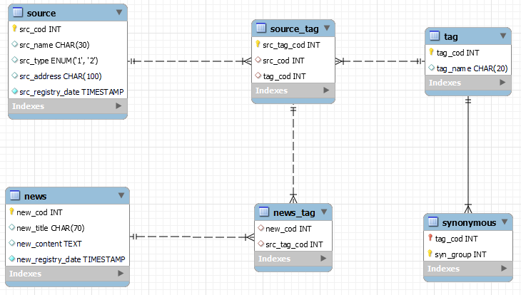

# [Portfólio API 4° Semestre - Morpheus](https://github.com/Morpheus-Fatec/morpheus)
Portfólio de metodologia de Gabriel Alves de Souza

## DESCRIÇÃO: 
Projeto desenvolvido pela equipe [Morpheus](https://github.com/Byte-Boost), alunos do 4° Semestre de Banco de Dados. Desenvolvimento de uma aplicação web responsável por realizar raspagem de dados de portais pré-definidos a partir de tags designadas. Após o recebimento dos dados, gerenciá-los a longo prazo, efetuando ligações de conteúdos semelhantes com o objetivo de servir como fundamento para tomada de decisões e análise futuras. Projeto proposto pela FATEC e realizado em parceria com a empresa Visiona.

## TECNOLOGIAS:
 - Versão 21  
 JavaScript - Versão ES6+  
 - Versão 5.3.3  
 - Versão 8.0  
 - Versão 3.3.3  
 - Versão 3  
  
JDBC MySQL - Versão 8.0.26  
Maven - Versão 3.8.1  

## CONTRIBUIÇÕES PESSOAIS
### Desenvolvimento inicial do modelo de dados: 
Muito atrelado às minhas demandas no trabalho e meus desenvolvimentos pessoais, logo puxei essa tarefa para que pudesse entender ainda melhor a relação entre tabelas, seus padrões de normalização e como otimizar o armazenamento de dados visando futuras consultas. 

Além disso, realizei o desenvolvimento do diagrama de entidade e relacionamento para estruturar o banco e criação do DDL inicial da aplicação.



### Configuração de agendamento de tarefas CRON:
Essa atividade me despertou muita curiosidade para entender como poderia executar tarefas de forma assíncrona e programada. Nesse desenvolvimento pude compreender como o Spring realiza a gestão dos beans e os mantém desempeanhado de forma automaticamente de acordo com as configurações definidas.

Para adotar o agendamento de tarefas é necessário utilizar as seguintes tags, informando a adoção da tratativa na aplicação.
```
@Configuration
@EnableScheduling
```
Em seguida, adotamos uma classe para gerir as ações do Cron. Nela foram informadas todas as características do schedule que haviam sido definidas no properties e os métodos responsáveis por integrar as tarefas que seriam agendadas.
```
@Value("${cron.expression:0 * * * * *}") 
private String cronExpression;

@Value("${cron.timeZone:America/Sao_Paulo}") 
private String cronTimeZone;

public CronManager() {
    taskScheduler = new ThreadPoolTaskScheduler();
    ((ThreadPoolTaskScheduler) taskScheduler).initialize();
}
```

### Implementação de controller para permitir personalização do agendamento:
Após a configuração do cron, a próxima etapa era permitir que a funcionalidade fosse configurável de acordo com a necessidade do cliente. Foi realizada a implementação de mais uma api rest com objetivo de atualizar as configurações se agendamento de acordo com a nessecidade do usuário.
```
@Value("${cron.expression:0 * * * * *}") 
private String cronExpression;

@Value("${cron.timeZone:America/Sao_Paulo}") 
private String cronTimeZone;

public CronManager() {
    taskScheduler = new ThreadPoolTaskScheduler();
    ((ThreadPoolTaskScheduler) taskScheduler).initialize();
}
```
### Integração do agendamento para raspagem de dados web de notícias:
Finalizado o processo de configuração do agendamento, iniciou-se o processo de integração com as tarefas de raspagem de dados para construção do acervo de notícias. Para isso, fizemos a integração entre os métodos automaticamente executados e as demais funções que seriam executadas.

Na efetuação dessa task, foi necessário realment

### Aplicação de filtro de tags dinâmicos associados a portais de notícia:
Desenvolvimento de filtros dinâmicos para listagem de notícias e portais de notícias. Realização de meio em que seriam exibidas apenas as tags vinculadas ao portal informado

## APRENDIZADOS EFETIVOS:
### HARDSKILLS
- <ins>**Aprimoramento de modelagem de dados:**</ins> esse foi um dos meus focos de estudo nesse semestre. Acompanhando a matéria das aulas e as necessidades do trabalho, busquei melhores práticas de modelagem e aprendi sobre normalização.
  
- <ins>**Desenvolvimento em controle de exceções:**</ins> em outros projetos precisei fazer dessa técnica, mas apenas por necessidade, sem entender o que estava sendo realizado e apenas aplicando através do autocomplete da IDE. Nesse projeto, fui intencional e aplicá-las compreender seu funcionamento.
  
- <ins>**Implementação de métodos http e manipulação de JSON:**</ins> esse foi o primeiro projeto de desenvolvimento web que havia participado até então. Pude compreender como se comportavam os métodos, como realizar integrações através de requisições e como acessá-las na manipulação de JSON.

- <ins>**Capacidades de refatoração e otimização de desempenho:**</ins> um dos requisitos não funcionais exigidos por nosso cliente foi a performance da aplicação. Por isso, dentre os desenvolvimentos da sprint, sempre haviam tarefas focadas em aprimorar a aplicação e o processamento de suas operações

- <ins>**Conhecimento de Git e suas funções:**</ins> pude expandir meus conhecimentos de versionamento através do Git e organização de projetos, práticas essas que trouxe para meu time no trabalho. 

### SOFTSKILLS
- <ins>**Perpectiva do todo da aplicação:**</ins> em outros semestres dois semestres havia desempenhado papéis de SM e PO, fazendo-se mais intuitivo e natural a compreensão da aplicação como um todo. Já como time desenvolvimento, precisei agir com intecionalidade para acompanhar desenvolvimentos por vezes distantes dos meus.
  
- <ins>**Desenvolvimento cooperativo:**</ins> Em meu primeiro API como time de desenvolvimento, precisei em atuar em várias frentes de desenvolvimento, auxiliando no desenvolvimento de funcionalidades de outros membros, resolvendo inconsitências e assumindo tasks incompletas. Nesse projeto fizemos uma organização mais concisa do time, onde todos desempenhavam e se responsabilizavam por suas entregas, trazendo mais produtividade e qualidade e menos desgate.
  
- <ins>**Gestão de prioridades alinhados ao MVC:**</ins> Com um time mais organizado e harmônico, pude me dedicar mais às tasks de minha responsabilidade, podendo planejá-las e propôr novas formas e tecnologias para aplicação. Através disso, pude fazer aplicação do MVC para balancear minhas entregas visando entregas de boa qualidade e que agregassem valor.
